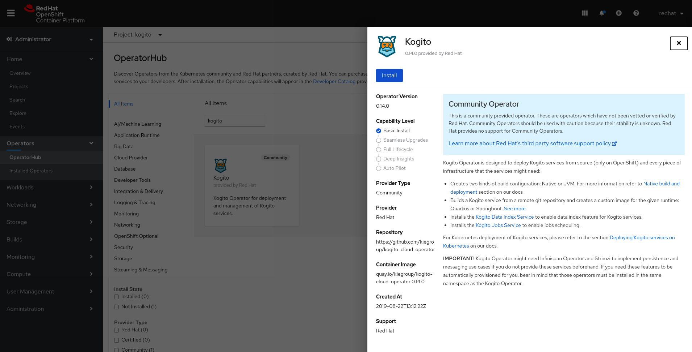
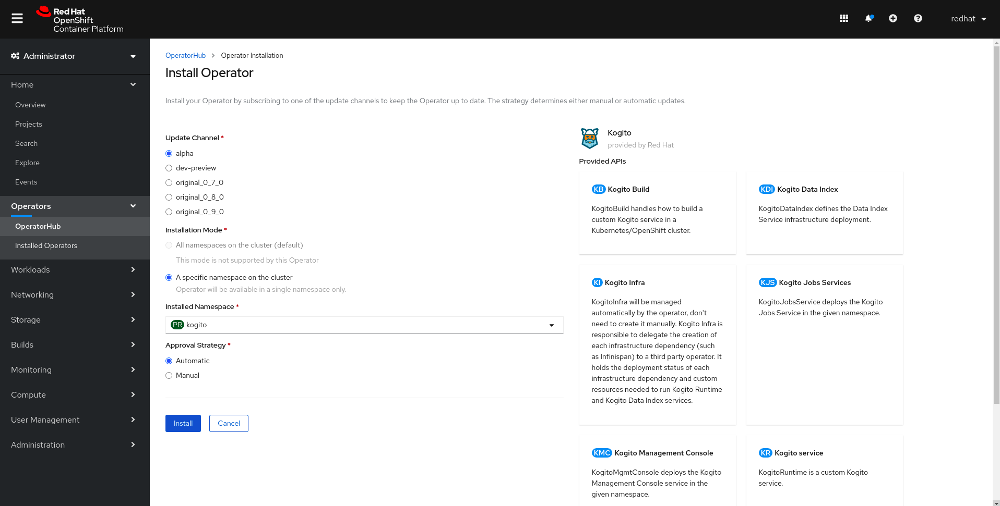

= Kogito on OCP
Álvaro López Medina <alopezme@redhat.com>
v1.0, 2020-08
// Create TOC wherever needed
:toc: macro
:sectanchors:
// :source-highlighter: coderay
// :source-highlighter: highlightjs
:source-highlighter: pygments
// Enable admonition icons
:icons: font
// :sectlinks:
// Create the Table of contents here
toc::[]
//:imagesdir: images

This repository is a starting point for developers who want to start with Kogito on OCP 4.

== What is Kogito

Kogito is a cloud-native business automation technology for building cloud-ready business applications. Kogito is designed specifically to excel in a hybrid cloud environment and to be adaptable to your domain and tooling needs. The core objective of Kogito is to help you mold a set of business processes and decisions into your own domain-specific cloud-native set of services [1].

[1] https://docs.jboss.org/kogito/release/latest/html_single/#con-kogito-automation_kogito-docs

== Kogito documentation

* https://kogito.kie.org/get-started/[Open source]
* https://docs.jboss.org/kogito/release/latest/html_single[Red Hat]

== Kogito tools

*Kogito VSCode extension*: (Recommended) Enables you to view and design BPMN models, DMN models, and test scenario files in Visual Studio Code (VSCode). [1]

*Kogito GitHub Chrome extension*: Enables you to view and design BPMN and DMN models in GitHub repositories in Google Chrome.

[1] https://chrome.google.com/webstore/detail/bpmn-dmn-test-scenario-ed/mgkfehibfkdpjkfjbikpchpcfimepckf
[2] https://marketplace.visualstudio.com/items?itemName=kie-group.vscode-extension-kogito-bundle

== Creating a Maven project for a Kogito service

[source,bash]
----
mvn archetype:generate \
    -DarchetypeGroupId=org.kie.kogito \
    -DarchetypeArtifactId=kogito-quarkus-archetype \
    -DgroupId=org.acme \
    -DartifactId=sample-kogito \
    -DarchetypeVersion=0.14.0 \
    -Dversion=1.0-SNAPSHOT

----

== Deploying Kogito services on OpenShift

To help you deploy your services on OpenShift, Kogito provides an operator and a command-line interface (CLI):

*Kogito Operator*: An operator that guides you through the deployment process. [1]
*Kogito command-line interface (CLI)*: A CLI tool that enables you to interact with the Kogito Operator for deployment tasks. [2]

=== Kogito operator dependencies

Before installing the Kogito operator you may need to install two operators: Infinspan and 

=== Install Kogito operator

First, create a project to host the Kogito deployment:

[source,bash]
----
oc new-project kogito-project --display-name="Kogito"
----

Second, look for the Kogito operator on the `Operator Hub`:

Third, configure the operator subscription:

[1] https://github.com/kiegroup/kogito-cloud-operator
[2] https://github.com/kiegroup/kogito-cloud-operator/releases

== Kogito Operator architecture

*KogitoBuild*: Defines the build configurations for Kogito domain-specific services deployed on OpenShift

*KogitoRuntime*: Defines the deployment configurations for Kogito domain-specific services deployed on Kubernetes or OpenShift from a container image in an image registry

*KogitoDataIndex, KogitoJobsService, and KogitoMgmtConsole*: Define the deployment configurations for the Kogito Data Index Service, Jobs Service, and Management Console. Kogito provides a Data Index Service that stores all Kogito events related to processes, tasks, and domain data. 

*KogitoInfra*: Defines the relevant middleware infrastructure component or third-party operator for the Kogito service, such as Infinispan for persistence or Apache Kafka for messaging

== Listing Kogito objects on OCP

Check all the Custom Resource Definitions (CRDs) created by the Kogito operator:

[source, bash]
----
oc api-resources | grep "kogito"
----

Check all the Custom Resources (CRs) created:

[source, bash]
----
oc get kogitobuilds,kogitodataindices,kogitoinfras,kogitojobsservices,kogitomgmtconsoles,kogitoruntimes,kogitotrusties
----

== Decision-authoring assets in Kogito [1]

[1] https://docs.jboss.org/kogito/release/latest/html_single/#ref-decision-authoring-assets_kogito-developing-decision-services

